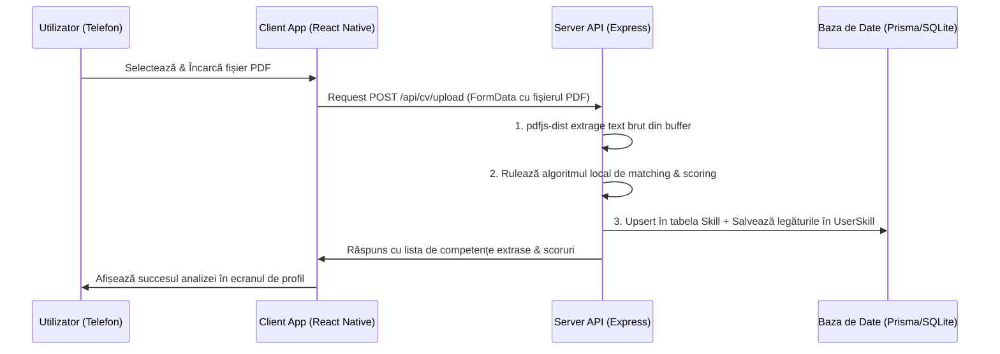

# 📂 Modulul: Analiza de CV & Extragerea de Competențe

Acest modul se ocupă de citirea automată a CV-urilor încărcate de utilizatori, convertirea fișierelor PDF în text brut, identificarea competențelor tehnice deținute și auto-configurarea unui nivel inițial al profilului.

---

## 🎯 1. Scopul Funcționalității
* **Problema rezolvată**: Completarea manuală a unui profil profesional pe o aplicație mobilă poate fi anevoioasă și descurajantă pentru utilizatori, ducând la rate de abandon mari.
* **Beneficiul adus**: Utilizatorul își încarcă pur și simplu CV-ul în format PDF, iar aplicația îi configurează instantaneu profilul cu tehnologiile pe care le cunoaște deja. Acest profil este apoi folosit direct de sistemul de recomandări de carieră și de chatbot-ul AI pentru consiliere personalizată.

---

## 🗺️ 2. Cum Funcționează (Arhitectura pe Etape)

Procesul urmează un flux de date securizat în 5 pași principali:



1. **Încărcare**: Utilizatorul selectează un fișier din spațiul de stocare al telefonului prin intermediul API-ului nativ `expo-document-picker`.
2. **Trimitere**: Aplicația mobilă creează un obiect `FormData` și trimite o cerere `POST` de tip `multipart/form-data` către endpoint-ul `/api/cv/upload`, securizată cu token-ul de sesiune JWT în header.
3. **Procesare**: Middleware-ul `Multer` de pe server interceptează fișierul sub formă de buffer direct în memorie (`req.file.buffer`).
4. **Analiză**: Serverul folosește `pdfjs-dist` pentru extragerea textului, apoi aplică expresii regulate optimizate pe baza catalogului de referință (`KNOWN_SKILLS`).
5. **Persistență și Răspuns**: Skill-urile identificate sunt salvate direct în baza de date ca relații ale utilizatorului, iar lista este returnată către client pentru afișarea instantanee pe profil.

---

## 🔍 3. Detaliile din Culise (Behind the Scenes)

### Extragerea Textului:
* Folosește build-ul legacy al bibliotecii **`pdfjs-dist`**, deoarece acesta este compatibil cu serverele de backend fără suport nativ pentru DOM-ul din browser.
* În cazul în care PDF-ul are o codificare nestandardizată, serverul aplică un fallback pe baza conversiei buffer-ului brut într-un string lizibil (`latin1`/`utf-8`) și curățarea caracterelor invalide utilizând regex-ul:
  ```javascript
  text.replace(/[\x00-\x08\x0B\x0C\x0E-\x1F\x7F-\x9F]/g, ' ')
  ```

### Matching-ul și Evitarea Fals-Pozitivelor (Coliziuni):
* **Limbaje scurte (C, Go, R)**: 
  * Căutarea simplă a cuvântului "C" într-un text ca *"Cunosc limbajul Java"* ar duce la un fals-pozitiv pe prima literă.
  * Pentru limbajul `C`, verificăm ca acesta să apară izolat prin semne de punctuație sau spații clare (ex: `C,`, `C/C++`).
  * Pentru limbajul `Go`, folosim o expresie regulată strictă care asociază apariția cuvântului cu secțiunea dedicată tehnologiilor (ex: `Languages: Go` sau `Skills: Go`).
* **Sortarea Master-List-ului**:
  Catalogul de skill-uri (`KNOWN_SKILLS`) este sortat descrescător după lungime. De exemplu, `React Native` (lungime 12) va fi căutat înaintea cuvântului `React` (lungime 5). Când se găsește `React Native`, contextul este marcat pentru a preveni re-detectarea eronată a simplului cuvânt `React` pe aceeași porțiune.

### Algoritmul de Calcul al Scorului pe Baza Contextului:
Pentru fiecare competență găsită în text, serverul decupează o fereastră de context de $\pm 100$ de caractere în jurul poziției unde s-a făcut potrivirea. În această fereastră se caută indici de profunzime a utilizării tehnologiei:
* **Scor de bază**: `30` puncte (Beginner).
* **Cuvântul "proiect" / "project"** $\to$ `+20` puncte (proiect personal realizat).
* **Cuvântul "job" / "work" / "experiență"** $\to$ `+30` puncte (experiență în mediul profesional real).
* **Cuvântul "internship" / "intern"** $\to$ `+20` puncte (experiență ghidată).
* **Cuvântul "senior" / "expert"** $\to$ `+20` puncte (nivel avansat).
* **Plafonare**: Scorul maxim extras direct din CV este limitat la `85` pentru a rezerva scorul de 100% testelor de evaluare grilă din aplicație.

---

## 💾 4. Ce se întâmplă în Baza de Date?

Modulul de analiză interacționează direct cu tabelele de date SQLite prin intermediul Prisma:

### Tabelele Afectate:

1. **`Skill`**:
   * *Operație*: `upsert` (dacă tehnologia din CV nu este încă în nomenclator, ea este creată ca o nouă înregistrare globală).
   * *Câmpuri modificate*: `name` (numele unic al tehnologiei).

2. **`UserSkill`**:
   * *Operație*: `upsert` (leagă utilizatorul curent de tehnologia respectivă).
   * *Câmpuri salvate*:
     * `userId`: ID-ul utilizatorului care a încărcat CV-ul.
     * `skillId`: ID-ul tehnologiei identificate.
     * `cvScore`: Scorul extras din analiză (calculat între 30 și 85).
     * `level`: Determinat direct din valoarea scorului:
       * `Beginner` (Scor < 40)
       * `Intermediate` (Scor 40-69)
       * `Advanced` (Scor >= 70)

3. **`User`**:
   * *Operație*: `update` (se salvează textul brut extras pentru a fi utilizat ca și context în alte secțiuni, cum ar fi Chatbot-ul AI).
   * *Câmpuri modificate*: `cvText`.
