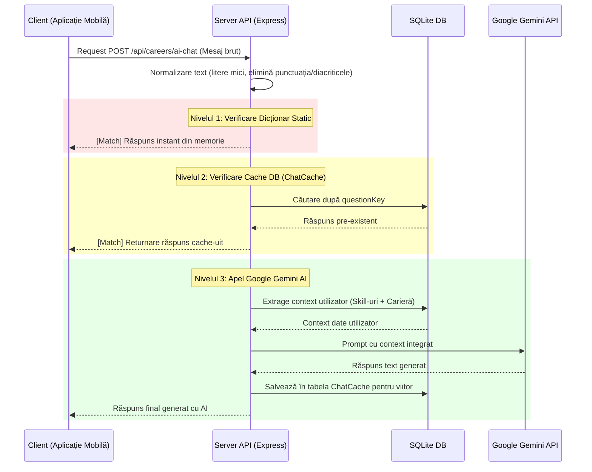

# 🤖 Modulul: Chatbot AI cu Optimizare în 3 Nivele

Acest modul pune la dispoziție un asistent virtual inteligent, capabil să răspundă la întrebări legate de carieră, salarii, strategii de studiu și concepte tehnice. Logica de bază rulează pe server în `server/routers/careers.mjs`.

---

## 🎯 1. Scopul Funcționalității
* **Problema rezolvată**: Integrarea unui chatbot bazat pe Inteligență Artificială direct în cloud (ex. Gemini, OpenAI) poate duce la latențe ridicate pentru răspunsuri, costuri ridicate pe bază de tokeni consumați și vulnerabilitate la atingerea limitelor de API (Rate Limiting).
* **Beneficiul adus**: Aplicația pune la dispoziție o structură hibridă de caching. Întrebările uzuale sunt deservite instantaneu și gratuit local din dicționare sau din baza de date a serverului. Doar întrebările unice și complexe sunt transmise către modelul generativ extern Google Gemini, economisind peste 80% din resurse.

---

## 🗺️ 2. Cum Funcționează (Arhitectura pe Etape)

Fiecare mesaj trimis de utilizator pe mobil parcurge următoarele etape:



1. **Expediere**: Utilizatorul introduce o întrebare în interfața de chat și apasă trimitere. Mesajul este expediat printr-o cerere HTTP `POST` către `/api/careers/ai-chat`.
2. **Normalizare**: Backend-ul curăță întrebarea pentru a obține o formă canonică standardizată, independentă de scriere.
3. **Filtrare Nivelul 1**: Verifică dacă textul normalizat se potrivește cu temele din dicționarul local de răspunsuri rapide (ex: *"bună"*, *"ce este docker"*). Dacă da, îl întoarce imediat clientului.
4. **Filtrare Nivelul 2**: Verifică dacă întrebarea normalizată a mai fost pusă anterior și salvată în tabela `ChatCache`. Dacă da, o extrage și o trimite direct.
5. **Apel Generative AI (Nivelul 3)**: Dacă nu există nicio potrivire anterioară, serverul preia contextul utilizatorului (profilul de skill-uri și cariera selectată) din baza de date, construiește un prompt ghidat către modelul `gemini-2.0-flash`, generează răspunsul, îl stochează în cache și îl livrează pe telefon.

---

## 🔍 3. Detaliile din Culise (Behind the Scenes)

### Funcția de Normalizare a Întrebărilor:
Pentru a se asigura că întrebări scrise diferit dar cu același înțeles (de ex. *"Ce e git?"* și *"ce este, git!?"*) folosesc același cache, se folosește funcția:
```javascript
const normalizeQuestion = (text) => {
    return text
        .toLowerCase()
        .trim()
        .replace(/[?!.,;:'"]/g, '')       // Elimină punctuația
        .replace(/\s+/g, ' ')              // Comprimă spațiile multiple
        .replace(/ă/g, 'a').replace(/â/g, 'a').replace(/î/g, 'i')
        .replace(/ș/g, 's').replace(/ț/g, 't'); // Înlocuiește diacriticele românești
};
```

### Injectarea Contextului de Carieră:
Pentru ca Gemini să nu ofere sfaturi generice, promptul trimis este structurat sub forma unui sistem de instrucțiuni:
```javascript
let systemContext = `Ești un consilier de carieră IT în limba română. Context: Utilizatorul are competențele: [${userSkillsList}]. Se orientează către rolul de [${careerName}]. Răspunde succint (maxim 3-4 propoziții), profesional, la obiect.`;
```

### Fallback-ul de Urgență:
Dacă cheia API a fost revocată, s-a atins limita de apeluri sau nu există conexiune stabilă la serviciile Google, aplicația are un array de răspunsuri pre-formate prietenoase (fallbacks), cum ar fi:
*"Momentan procesez multe solicitări de carieră. Între timp, îți propun să parcurgi testele grilă pentru a acumula puncte."* Acest lucru evită blocarea aplicației în ecranul utilizatorului.

---

## 💾 4. Ce se întâmplă în Baza de Date?

Modulul de Chat folosește baza de date SQLite pentru a prelua contextul curent al profilului și pentru a stoca rezultatele cache-ului:

### Tabelele Afectate:

1. **`User` și `UserSkill`** (Doar Citire):
   * Serverul interoghează utilizatorul curent (`userId`) pentru a afla ce carieră are setată (`selectedCareerId`) și lista de abilități corelate cu nivelul lor din tabela `UserSkill`.

2. **`ChatCache`**:
   * *Operație*: `findUnique` și `create`.
   * Atunci când o întrebare nouă trece prin nivelul 3 și primește un răspuns valid de la Gemini, serverul stochează o nouă înregistrare:
     * `questionKey`: Întrebarea normalizată (cheie unică).
     * `careerId`: ID-ul carierei selectate de utilizator în acel moment (pentru a izola răspunsurile pe nișe).
     * `response`: Textul complet al răspunsului generat de Gemini.
     * `createdAt`: Data creării cache-ului.
