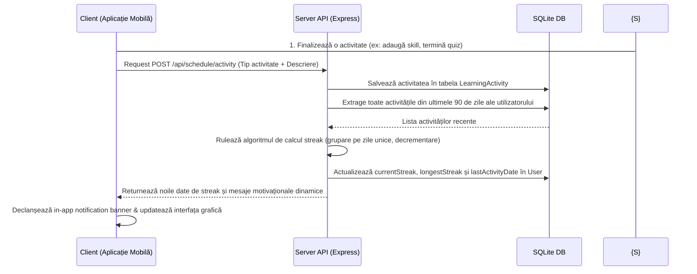

# 🎮 Modulul: Gamificare, Streak-uri & Activități

Acest modul se ocupă de fidelizarea și motivarea utilizatorului prin strategii specifice jocurilor: menținerea consecutivității studiului (streak), vizualizarea activității sub formă de calendar istoric, evaluarea cunoștințelor prin chestionare tehnice și planificarea orelor de studiu. Codul rulează pe server în `server/routers/schedule.mjs`.

---

## 🎯 1. Scopul Funcționalității
* **Problema rezolvată**: În procesul de învățare pe cont propriu, cea mai mare barieră este lipsa de consecvență și abandonul rapid în absența unui feedback imediat al progresului.
* **Beneficiul adus**: Utilizatorul este stimulat să deschidă zilnic aplicația prin intermediul unui contor de "streak" (zile consecutive active) și a unui calendar vizual de activitate (stil GitHub contributions). De asemenea, își poate testa direct nivelul prin teste grilă rapide, care îi cresc dinamic scorul profilului la finalizare.

---

## 🗺️ 2. Cum Funcționează (Arhitectura pe Etape)

Procesul implică următorul flux client-server pentru raportarea și înregistrarea progresului:



1. **Trigger de Activitate**: Când utilizatorul completează o acțiune cheie în aplicație (ex: adaugă manual un skill, îi crește nivelul, finalizează un quiz tehnic), clientul trimite o cerere `POST` la `/api/schedule/activity`.
2. **Înregistrare**: Serverul salvează activitatea și preia istoricul recent al utilizatorului.
3. **Calculul de Streak**: Serverul recalculează streak-ul curent și maxim pe baza datelor stocate.
4. **Sincronizare Utilizator**: Actualizează proprietățile de streak direct pe modelul de date al utilizatorului.
5. **Randare Calendar**: La accesarea paginii de profil, endpoint-ul `GET /api/schedule` generează o grilă fixă de 28 de zile consecutive din trecut, marcând zilele cu activități.

---

## 🔍 3. Detaliile din Culise (Behind the Scenes)

### Algoritmul de Streak pe Zile Calendaristice Unice:
Pentru a evita ca utilizatorul să abuzeze de sistem (de exemplu, dacă adaugă 10 skill-uri în 5 minute să primească un streak de 10 zile), algoritmul implementează următoarea logică:
* **Gruparea pe Zile**: Transformăm data fiecărei activități în format string `YYYY-MM-DD` (eliminând orele) și aplicăm `new Set()` pentru a păstra doar zilele calendaristice distincte:
  ```javascript
  const uniqueDays = [...new Set(activities.map(a => formatDate(a.date)))].sort().reverse();
  ```
* **Verificarea Consecutivității**: 
  * Verificăm dacă cel mai recent element din `uniqueDays` este ziua de **azi** sau de **ieri**. Dacă nu, streak-ul este `0` (s-a întrerupt consecutivitatea).
  * Dacă consecutivitatea este validă, pornim din acea zi și scădem câte o zi calendaristică. Cât timp ziua calculată se regăsește în `uniqueDays`, incrementăm `currentStreak`. La prima zi lipsă din istoric, algoritmul se oprește.

### Randarea Calendarului Istoric de 28 de zile:
Pentru a desena grila de activitate, backend-ul calculează ziua de luni a săptămânii curente, merge în urmă cu 3 săptămâni complete și generează o listă fixă de 28 de zile. Pentru fiecare zi, verifică prin intermediul metodei `.some()` dacă utilizatorul are cel puțin o activitate înregistrată în baza de date în acea dată exactă:
```javascript
completed: calendarActivities.some(a => isSameDay(new Date(a.date), d))
```

### Sistemul de Notificări Native (Local Push Notifications):
Pentru a stimula revenirea utilizatorului în aplicație (remindere zilnice sau avertismente privind pierderea streak-ului), am implementat un modul bazat pe **`expo-notifications`**:
* **Solicitarea Permisiunilor**: La prima pornire, aplicația utilizează `Notifications.requestPermissionsAsync()` pentru a cere permisiunea sistemului de operare de a afișa alerte sonore și vizuale.
* **Canalul de Notificări Android**: Android 8.0+ necesită canale de notificare pentru livrare. Am definit canalul `careermentor-reminders` cu importanță maximă (`AndroidImportance.MAX`) și model de vibrație customizat.
* **Mecanismul de Schedulere**: 
  * Când utilizatorul își actualizează ora în `ScheduleSetupModal`, serverul salvează datele în SQLite, iar hook-ul de pe client apelează `Notifications.cancelAllScheduledNotificationsAsync()` pentru curățarea planificărilor vechi.
  * Apoi rulează `Notifications.scheduleNotificationAsync()` cu un trigger de tip `DAILY` la ora setată de utilizator.
* **Mecanismul de Testare Demo la Logare**:
  * Pentru a demonstra facil funcționalitatea în fața comisiei fără a aștepta ora programată de reminder, aplicația programează automat o notificare nativă cu o întârziere de 5 secunde imediat ce utilizatorul se conectează (ajunge pe ecranul `home.jsx`).
  * Studentul se loghează în fața comisiei, pune aplicația în fundal sau blochează ecranul, iar după 5 secunde sistemul de operare va afișa bannerul de notificare nativ cu mesajul motivațional: *"👋 Bine ai revenit pe CareerMentor! Fiecare zi petrecută învățând te aduce mai aproape de jobul ideal! Continuă studiul activ! 🚀"*. Acest flux demonstrează perfect livrarea nativă în fundal.

---


## 💾 4. Ce se întâmplă în Baza de Date?

Modulul utilizează intens tabelele din SQLite pentru a ține evidența progresului și a configurărilor:

### Tabelele Afectate:

1. **`LearningActivity`**:
   * *Operație*: `create` și `findMany`.
   * Stochează fiecare acțiune cu proprietățile: `userId`, `type` (ex: `"quiz_completed"`, `"skill_added"`), `description` (ex: *"A finalizat testul de JavaScript cu scorul de 90%"*), și `date` (timestamp-ul salvării).

2. **`User`**:
   * *Operație*: `update`.
   * Câmpuri modificate:
     * `currentStreak`: Numărul curent de zile consecutive active.
     * `longestStreak`: Recordul istoric de zile active al utilizatorului.
     * `lastActivityDate`: Data ultimei activități înregistrate.

3. **`LearningSchedule`**:
   * *Operație*: `upsert` și `delete`.
   * Gestionează preferințele de reminder ale utilizatorului:
     * `frequency`: Frecvența programată (`daily`, `every_2_days`, `weekly`).
     * `reminderHour` / `reminderMinute`: Ora stabilită pentru notificări.
     * `isActive`: Statusul activ/inactiv al planificatorului.

4. **`UserQuizResult`**:
   * *Operație*: `create`.
   * Stochează rezultatul testelor grilă: `userId`, `careerId`, `score` (scorul obținut exprimat în procente de la 0 la 100).
