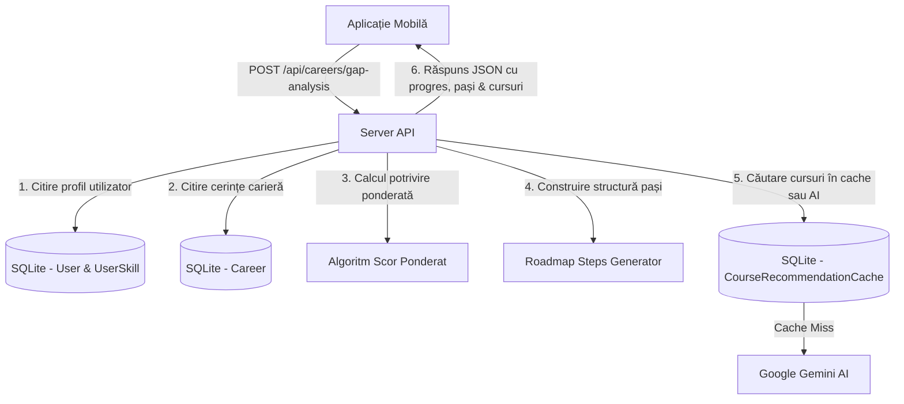

# 📊 Modulul: Gap Analysis & Roadmap Dinamic

Acest modul realizează o analiză a diferențelor dintre nivelul actual al studentului și cel cerut de piață pentru o anumită carieră. Pe baza acestei analize, generează o cale de învățare arborescentă și propune cursuri Udemy/Coursera pentru acoperirea lipsurilor.

---

## 🎯 1. Scopul Funcționalității
* **Problema rezolvată**: Trecerea de la stadiul de învățăcel la cel de angajabil într-un rol IT este de multe ori haotică, studenții neștiind exact ce competențe le lipsesc și în ce ordine ar trebui să le studieze.
* **Beneficiul adus**: Utilizatorul primește o analiză de compatibilitate dinamică exprimată în procente. Primește, de asemenea, un roadmap interactiv împărțit pe pași logici (Fundamentals, Tooling, Frameworks) care îi arată vizual ce a completat deja și ce mai are de studiat. Pentru skill-urile lipsă, primește recomandări de cursuri reale.

---

## 🗺️ 2. Cum Funcționează (Arhitectura pe Etape)

Procesul este administrat de endpoint-ul `POST /api/careers/gap-analysis` din `server/routers/careers.mjs`:



1. **Cerere**: Ecranul de Roadmap solicită analiza trimițând token-ul de autorizare către server.
2. **Colectare date**: Serverul extrage abilitățile deținute de utilizator (cu scorurile aferente din CV/autoevaluare/quizzes) și lista de competențe impuse de carieră.
3. **Analiză**:
   * Calculează procentajul de potrivire pe baza ponderilor asociate nivelurilor de competență (Beginner, Intermediate, Advanced).
   * Identifică lista de tehnologii lipsă.
4. **Construire structură**: Grupează tehnologiile în categorii predefinite (Fundamentals, Frameworks etc.) și le marchează ca fiind finalizate sau nefinalizate.
5. **Recomandare cursuri**: Pentru primele skill-uri lipsă identifică 3 cursuri adaptate, utilizând sistemul de cache de cursuri.
6. **Livrabil**: Returnează obiectul complex de analiză către aplicația mobilă pentru a fi randat grafic.

---

## 🔍 3. Detaliile din Culise (Behind the Scenes)

### Formula Scorului de Potrivire Ponderat:
Spre deosebire de o evaluare binară simplă (dacă ai skill-ul = 1, dacă nu = 0), algoritmul acordă ponderi în funcție de nivel:
```javascript
const levelWeights = {
    'Beginner': 0.4,
    'Intermediate': 0.8,
    'Advanced': 1.0
};
```
Pentru fiecare abilitate cerută de carieră care este deținută de utilizator, se adaugă ponderea respectivă la suma totală. Abilitățile nedeținute primesc valoarea `0`.
$$\text{Scor Compatibilitate} = \frac{\sum \text{Pondre\_Skill\_Deținut}}{\text{Total\_Abilități\_Carieră}} \times 100$$

### Generarea Ierarhică a Roadmap-ului (Arbore JSON):
Cerințele de carieră sunt salvate în baza de date ca o structură JSON (de ex: un array de categorii cu skill-urile aferente). Serverul parcurge această structură și generează pașii:
* **Titlu categorie**: ex. *"Web Fundamentals"*
* **Descriere dinamică**: Generată automat prin regex-uri care caută cuvinte cheie în titlul categoriei (ex: dacă titlul conține *"database"* sau *"data"*, asociază textul *"Stocarea, modelarea și interogarea datelor folosind sisteme relaționale sau non-relaționale."*).
* **Progres**: ex. `"2/3 completed"`
* **completed**: Boolean setat pe `true` doar dacă toate skill-urile din categorie au fost dobândite de utilizator.

### Caching-ul Recomandărilor de Cursuri:
Pentru a nu stresa API-ul Gemini la fiecare accesare, am creat o cheie unică formatată din: `NumeCarieră|skill1,skill2,skill3` (skill-urile lipsă sortate alfabetic).
* **Dacă există în cache**: Se preia direct JSON-ul stocat.
* **Dacă nu există (Cache Miss)**: Se trimite un prompt către Gemini care îi cere explicit să recomande 3 cursuri în format JSON exact.
* **Fallback static**: În caz de eroare AI, se construiește instant o listă de linkuri directe de căutare pe platforma Udemy pentru termenii respectivi.

---

## 💾 4. Ce se întâmplă în Baza de Date?

Modulul interacționează cu următoarele structuri din SQLite:

### Tabelele Afectate:

1. **`Career`** (Doar Citire):
   * Citim proprietățile: `name`, `description`, și `skillsRequired` (JSON formatat ca string).

2. **`UserSkill`** (Doar Citire):
   * Citim toate înregistrările utilizatorului pentru a colecta denumirea abilităților și nivelurile lor curente (`level`).

3. **`CourseRecommendationCache`**:
   * *Operație*: `findUnique` și `create`.
   * Când se generează cursuri noi cu Gemini, acestea sunt stocate sub formă de șir JSON serializat:
     * `cacheKey`: String unic (ex: `"Backend Developer|docker,kubernetes,sql"`).
     * `coursesJson`: Cursurile recomandate serializate.
     * `createdAt`: Data salvării cache-ului.
