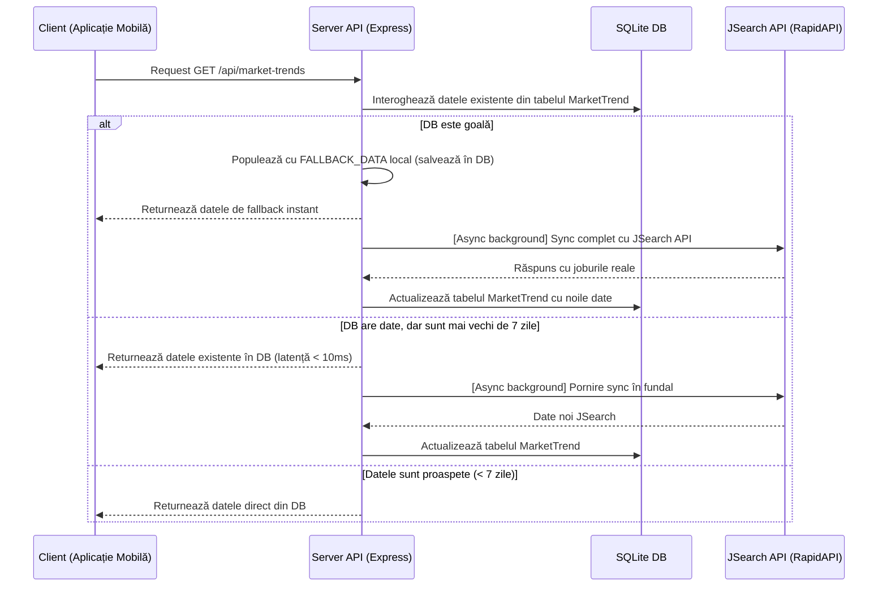

# 📈 Modulul: Tendințe pe Piața Muncii & Integrare API

Acest modul monitorizează dinamica joburilor din industria IT din România, colectând date legate de volumul de angajări, tehnologiile cele mai solicitate și scalele salariale estimate pentru diverse roluri tehnice. Codul backend rulează în `server/routers/marketTrends.mjs`.

---

## 🎯 1. Scopul Funcționalității
* **Problema rezolvată**: Informațiile despre oportunitățile de angajare din IT și scalele salariale din România sunt fragmentate pe diverse site-uri de recrutare și adesea greu accesibile centralizat.
* **Beneficiul adus**: Utilizatorul are acces, direct din ecranul de mobil, la statistici agregate actuale din România. El poate vedea dacă rolul ales (ex: DevOps vs QA) are o cerere ridicată pe piață, care sunt salariile estimate (Entry, Mid, Senior) și companiile active care angajează în acel moment.

---

## 🗺️ 2. Cum Funcționează (Arhitectura pe Etape)

Modulul integrează date interne stocate în baza de date cu date externe preluate de la un agregator global de locuri de muncă:

1. **Interogare**: Utilizatorul deschide ecranul "Trends". Telefonul trimite o cerere `GET` la `/api/market-trends`.
2. **Verificare cache temporal**: Serverul citește datele din tabela `MarketTrend`.
3. **Livrare rapidă**: Dacă există înregistrări, acestea sunt returnate instantaneu pe telefon pentru a nu bloca interfața.
4. **Actualizare asincronă în fundal (Lazy background sync)**: Dacă datele sunt mai vechi de 7 zile și cheia de API (`JSEARCH_API_KEY`) este configurată, serverul pornește asincron sincronizarea, transmițând cereri către JSearch. La final, actualizează baza de date locală, fiind pregătită pentru viitoarele accesări.

---

## 🔍 3. Detaliile din Culise (Behind the Scenes)

### Integrarea API JSearch:
* API-ul este apelat prin platforma RapidAPI la adresa `https://jsearch-mega.p.rapidapi.com/search`.
* Parametrii de căutare forțează rezultate relevante pentru piața locală prin adăugarea sufixului *"Romania"* la titlul jobului (ex: `"DevOps Engineer Romania"`).
* Se setează un `AbortSignal.timeout(8000)` pentru a întrerupe cererea în cazul în care API-ul extern are latențe mari, asigurând stabilitatea serverului nostru.

### Calculul Estimărilor Salariale:
Deoarece multe anunțuri de angajare nu publică salariile direct în text, backend-ul urmează o logică de agregare:
* Filtrează joburile care au completate proprietățile `job_min_salary` și `job_max_salary`.
* Dacă sunt disponibile date, calculează media lor.
* Calculează scalele de experiență:
  * **Entry Level**: `Math.round(mid * 0.7)` (70% din media națională).
  * **Mid Level**: Valoarea medie directă a anunțurilor (`(Min + Max) / 2`).
  * **Senior Level**: `Math.round(mid * 1.5)` (150% din media națională).
* Dacă nu se găsesc salarii declarate în mod public în rezultate, algoritmul asociază valorile estimate din dicționarul local `FALLBACK_DATA` (bazat pe rapoartele oficiale ale pieței de IT din România).

---

## 💾 4. Ce se întâmplă în Baza de Date?

Modulul interacționează direct cu tabela `MarketTrend` din SQLite:

### Structura Tabelei `MarketTrend`:

* **`id`**: Cheie primară autoincrementată.
* **`domain`**: Numele unic al rolului IT (ex: `"Frontend Developer"`, `"DevOps Engineer"`).
* **`topSkills`**: String ce conține principalele abilități cerute (ex: `"React, JavaScript, TypeScript"`).
* **`avgSalaryMin` / `avgSalaryMax`**: Intervalul salarial mediu brut/net estimat.
* **`avgSalaryEntry` / `avgSalaryMid` / `avgSalarySenior`**: Salariile calculate pe praguri de experiență.
* **`currency`**: Moneda de tranzacționare (setată implicit la `"RON"`).
* **`demandLevel`**: Nivelul cererii de pe piață (`"High"` sau `"Medium"`), stabilit în funcție de numărul de joburi active (peste 700 de joburi active reprezintă cerere mare).
* **`jobCount`**: Volumul estimat de locuri de muncă active detectate.
* **`growthPercent`**: Procentul anual de creștere estimat al nișei.
* **`source`**: Sursa datelor (ex: `"JSearch API / Google Jobs"` sau `"Industry Reports 2024"`).
* **`lastUpdated`**: Timestamp-ul ultimei actualizări efectuate (folosit de server pentru a verifica dacă au trecut cele 7 zile pentru a declanșa un nou sync).
