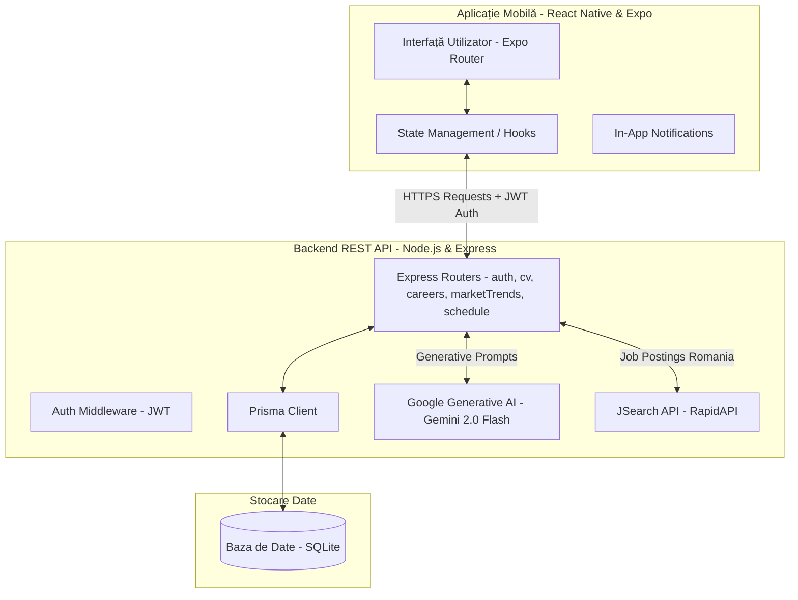

# Documentație Tehnică - Aplicație de Ghidare în Carieră (CareerMentor)

Acest folder conține documentația tehnică detaliată a fiecărui modul principal din aplicație. Aceasta a fost structurată special pentru a te ajuta să înțelegi în profunzime logica de programare din spate și să răspunzi cu ușurință la întrebările comisiei de susținere a licenței.

---

## 🗺️ Indexul Documentației

1. [🏗️ Arhitectura de Sistem & Structura Folderelor (ARHITECTURA_SISTEM.md)](file:///c:/Users/ioana/OneDrive/Desktop/LICENTA_VOICU_IOANA/Aplicatie%20licenta/docs/ARHITECTURA_SISTEM.md)
   * *Prezentarea structurii complete a folderelor (client, server, configs) și a modului de organizare modulară a fișierelor.*
2. [📂 Analiza de CV & Extragerea de Competențe (ANALIZA_CV.md)](file:///c:/Users/ioana/OneDrive/Desktop/LICENTA_VOICU_IOANA/Aplicatie%20licenta/docs/ANALIZA_CV.md)
   * *Cum se extrage textul din PDF, algoritmul de matching cu evitare a coliziunilor și logica de scoring bazată pe context.*
3. [🤖 Chatbot-ul AI cu Optimizare în 3 Nivele (CHATBOT_AI.md)](file:///c:/Users/ioana/OneDrive/Desktop/LICENTA_VOICU_IOANA/Aplicatie%20licenta/docs/CHATBOT_AI.md)
   * *Dicționarul de răspunsuri predefinite, sistemul de cache local în baza de date (SQLite) și integrarea modelului Gemini 2.0 Flash.*
4. [📊 Gap Analysis & Roadmap Dinamic (GAP_ANALYSIS_ROADMAP.md)](file:///c:/Users/ioana/OneDrive/Desktop/LICENTA_VOICU_IOANA/Aplicatie%20licenta/docs/GAP_ANALYSIS_ROADMAP.md)
   * *Cum se calculează compatibilitatea ponderată (Beginner/Intermediate/Advanced), randarea căilor de învățare și recomandările de cursuri.*
5. [📈 Tendințe pe Piața Muncii & Integrare API (PIATA_MUNCII.md)](file:///c:/Users/ioana/OneDrive/Desktop/LICENTA_VOICU_IOANA/Aplicatie%20licenta/docs/PIATA_MUNCII.md)
   * *Integrarea cu JSearch API (RapidAPI), agregarea datelor salariale din România, mecanismul de autosincronizare la 7 zile și fallback-ul local.*
6. [🎮 Gamificare, Streak-uri & Activități (GAMIFICARE_SI_ACTIVITATI.md)](file:///c:/Users/ioana/OneDrive/Desktop/LICENTA_VOICU_IOANA/Aplicatie%20licenta/docs/GAMIFICARE_SI_ACTIVITATI.md)
   * *Algoritmul de calcul al streak-ului pe zile unice consecutive, testele grilă (quizzes) de verificare a cunoștințelor și planificatorul de studiu.*
7. [🎓 Ghid de Pregătire pentru Susținere (PREGATIRE_SUSTINERE.md)](file:///c:/Users/ioana/OneDrive/Desktop/LICENTA_VOICU_IOANA/Aplicatie%20licenta/docs/PREGATIRE_SUSTINERE.md)
   * *Întrebări tehnice și de arhitectură probabil puse de comisie și răspunsurile științifice gata pregătite.*

---

## 🏗️ Arhitectura Generală a Sistemului

Aplicația este construită pe o arhitectură modernă de tip client-server (decuplată):

### Detalii Tehnologice Cheie:
* **Frontend**: React Native, Expo (SDK 54), Expo Router (File-based navigation), React Native Animated & Custom SVG (pentru randarea grafică a progresului - liquid gauge, history calendar).
* **Backend**: Node.js, Express framework, module de tip ES Modules (`.mjs`).
* **Database Access**: Prisma ORM, ideal pentru maparea datelor direct pe tipuri TypeScript/JavaScript fără a scrie query-uri SQL manuale, crescând siguranța și rapiditatea codării.
* **Baza de Date**: SQLite (stocată într-un fișier local `dev.db`), ideală pentru dezvoltare rapidă și deployment-uri ușoare, neavând nevoie de un server de baze de date extern separat.
